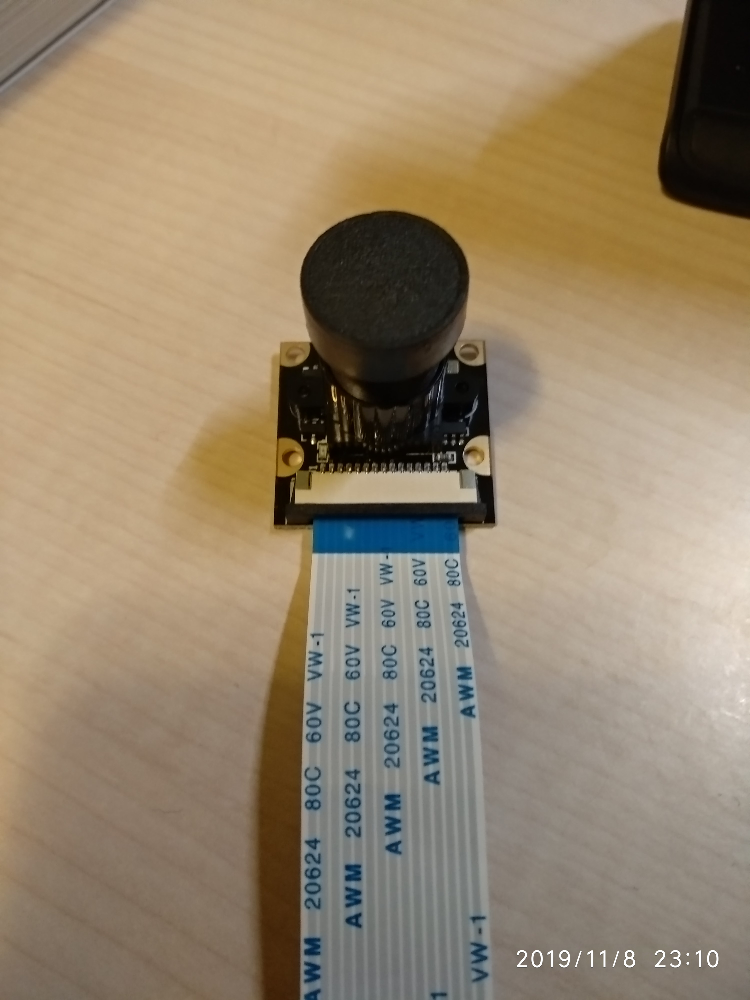

# Jetson-Nano-Log
## 19122019 Wroking in Nvidia Program??
[Blog](https://blogs.nvidia.com/blog/2016/07/29/whats-difference-artificial-intelligence-machine-learning-deep-learning-ai/) post reading.


Deep Learning
+ NN w/ internal parameters

## 08112019 Connecting with Camera again
With 5V/4A power source. And 

<table><tr>
<td></td>
<td></td>
<tr></table>

Run the script of "nvdli-nano/hello_camera/usb_camera.ipynb" and it can show the camera image

```console
!ls -ltrh /dev/video*

-l long
-t time sorting
-r reverse
-h better format
```

```python
from jetcam.usb_camera import USBCamera

camera = USBCamera(width=224, height=224, capture_width=640, capture_height=480, capture_device=0)
image = camera.read()
print(image.shape)
print(camera.value.shape)

# Create a widget to view the image stream
import ipywidgets
from IPython.display import display
from jetcam.utils import bgr8_to_jpeg

image_widget = ipywidgets.Image(format='jpeg')

image_widget.value = bgr8_to_jpeg(image)

display(image_widget)

camera.running = True

def update_image(change):
    image = change['new']
    image_widget.value = bgr8_to_jpeg(image)
    
camera.observe(update_image, names='value')
camera.unobserve(update_image, names='value')
```


Old:   
If the api got wrong, check [this](https://devtalk.nvidia.com/default/topic/1055004/csi-camera-raspberry-pi-v2-not-work-on-jetson-nano/)

## 01112019 Connecting with the Camera
Navigate to the path
> nvdli-nano/hello_camera/csi_camera.ipynb
The Notebooks consist of
+ Markdown
+ Code
The Key board shortcut is 
+ Shift + Enter:  run the current cell, select below
+ Ctrl + Enter:  run selected cells
+ Alt + Enter:  run the current cell, insert below
+ Ctrl + S:  save and checkpoint

I am using the CSI camera, when I run the ipython notebook, the python will return busy. I suspend that the power problem, since I am using 5V/2A power source and the recommand power source is 5V/4A. Will go and buy a better source and USB camera for backup.

<!--  -->
[//]: # (This may be the most platform independent comment)


TODO buy official Power source and Logitech C270 Webcam

## 31102019 Configurating in headless mode
> Account:
> cenzth@gmail.com;
> This is my ac.

> Jetsonnano;
> 615*****

> 192.168.55.1:8888


Headless mode, unsuccessful with opening the juptyer notebook on http://192.168.55.1:8888/. but able to access it though ssh(22),
Reflash the image again and skip the booting with monitor and directly using USB device mode.

The image inside the Deep Learning Course is different with the Jetson Nano Developer Kit SD Card Image. [NVIDIA DLI Jetson Nano SD Card Image](https://developer.download.nvidia.com/training/nano/dlinano_v1-0-0_image_20GB.zip) ==> dlinano_v1-0-0_image_20GB.zip

After flashing the new image onto Jetson Nano, open 192.168.55.1:8888, and password "dlinano". And successfully log in.

## 23102019 Flashing the Nano with the following image 
+ my [Jetson Nano Developer Kit SD Card Image](https://developer.nvidia.com/embedded/learn/get-started-jetson-nano-devkit#intro) ==> jetson-nano-sd-r32.2.1.zip

Program used to flash image: Etcher-Portable-1.4.6-x64.exe

I have boot it with monitor and USB and mouse, it can successfully boot up.

+++

Received Jetson Nano
