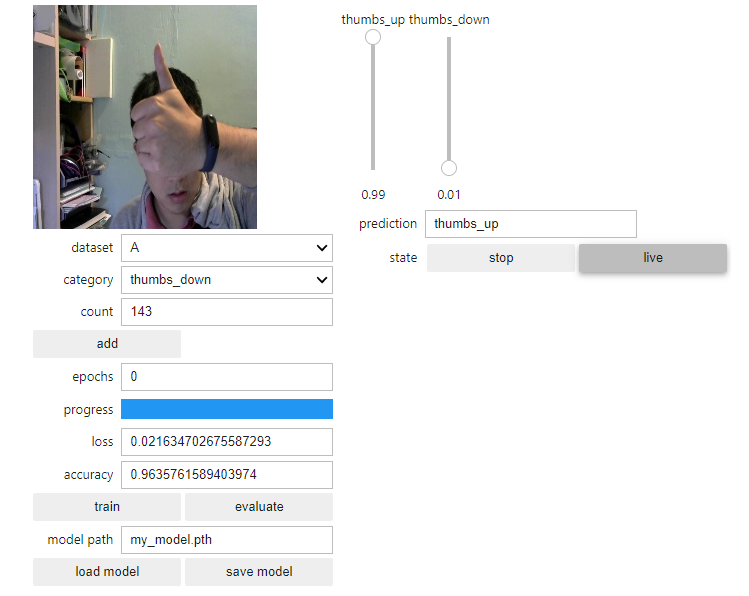
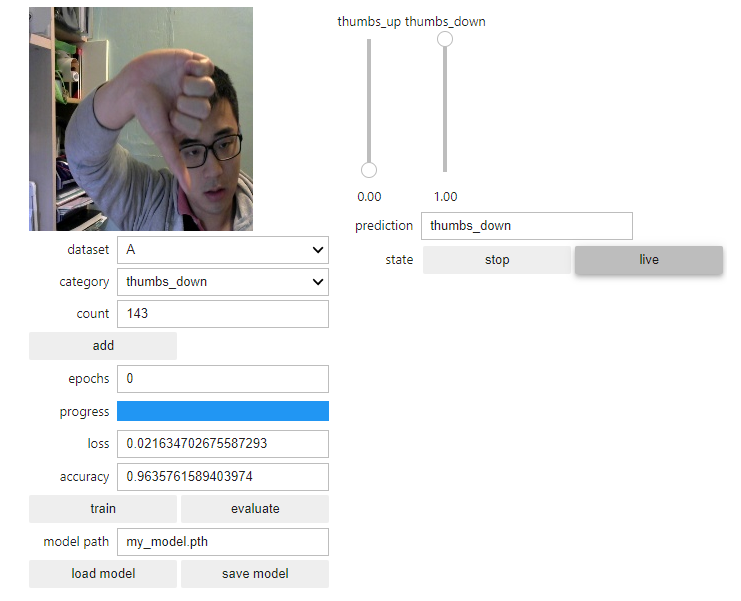
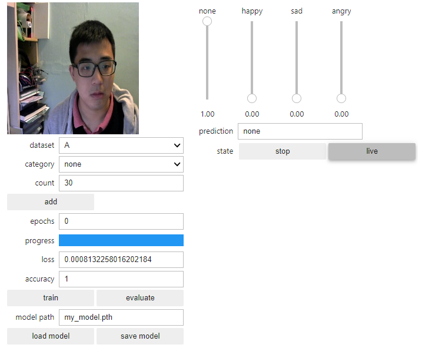
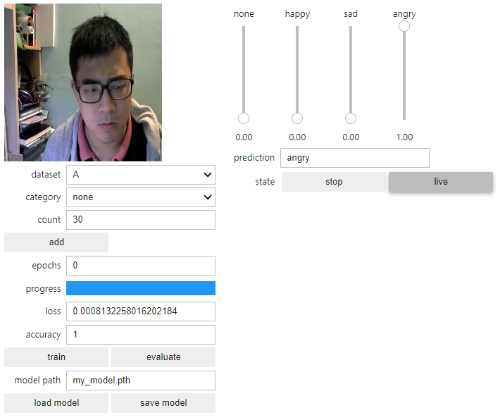

# FYP Daily Log-book

## 160120 Prepare Interim Report.

Notes

## 0701020 Classification Project

<table><tr>
<td></td>
<td></td>
<tr>
<tr>
<td></td>
<td></td>
<tr>
<tr>
<td></td>
<td></td>
<tr></table>

## 0201020 Study on ResNet-18 paper

Traditional CNN will decay performance when it go deeper and deeper. A residual block --> main branch and shortcut branch(output and input connect tgt). 

https://courses.d2l.ai/berkeley-stat-157/units/resnet.html

## 21122019 Study on CNN
CNN is used on the image recogiztion. Since my application is used to detect objevt like finger. So CNN will be used in my application. The Jetson Nano includes a 128-core NVIDIA Maxwell GPU.


Nvidia provide the SDK for us to develop our own CNN and perform on-device training.

About the architectures: ResNet-18 --> [ResNet](https://arxiv.org/pdf/1512.03385.pdf) mean Residual Networks, 18 means it has 18 layers. ResNet-18 is the smallest network.

Adapting transfer learning: change the last fully connected(FC) layer to our desire output. Keeping the input 512 to the deisre number of output.

## 19122019 Introduction to deep learning
[Blog](https://blogs.nvidia.com/blog/2016/07/29/whats-difference-artificial-intelligence-machine-learning-deep-learning-ai/) post reading.


Deep Learning
+ NN w/ internal parameters

Check the term that the utility part is called inference. epochs means the time we run the training. Deep learning is the board name of using neural network design.

## 08112019 Connecting with Camera again
With 5V/4A power source. And 

<table><tr>
<td></td>
<td></td>
<tr></table>

Run the script of "nvdli-nano/hello_camera/usb_camera.ipynb" and it can show the camera image

```console
!ls -ltrh /dev/video*

-l long
-t time sorting
-r reverse
-h better format
```

```python
from jetcam.usb_camera import USBCamera

camera = USBCamera(width=224, height=224, capture_width=640, capture_height=480, capture_device=0)
image = camera.read()
print(image.shape)
print(camera.value.shape)

# Create a widget to view the image stream
import ipywidgets
from IPython.display import display
from jetcam.utils import bgr8_to_jpeg

image_widget = ipywidgets.Image(format='jpeg')

image_widget.value = bgr8_to_jpeg(image)

display(image_widget)

camera.running = True

def update_image(change):
    image = change['new']
    image_widget.value = bgr8_to_jpeg(image)
    
camera.observe(update_image, names='value')
camera.unobserve(update_image, names='value')
```


Old:   
If the api got wrong, check [this](https://devtalk.nvidia.com/default/topic/1055004/csi-camera-raspberry-pi-v2-not-work-on-jetson-nano/)

## 01112019 Connecting with the Camera
Navigate to the path
> nvdli-nano/hello_camera/csi_camera.ipynb
The Notebooks consist of
+ Markdown
+ Code
The Key board shortcut is 
+ Shift + Enter:  run the current cell, select below
+ Ctrl + Enter:  run selected cells
+ Alt + Enter:  run the current cell, insert below
+ Ctrl + S:  save and checkpoint

I am using the CSI camera, when I run the ipython notebook, the python will return busy. I suspend that the power problem, since I am using 5V/2A power source and the recommand power source is 5V/4A. Will go and buy a better source and USB camera for backup.

<!--  -->
[//]: # (This may be the most platform independent comment)


TODO buy official Power source and Logitech C270 Webcam

## 31102019 Configurating in headless mode
> Account:
> cenzth@gmail.com;
> This is my ac.

> Jetsonnano;
> 615*****

> 192.168.55.1:8888


Headless mode, unsuccessful with opening the juptyer notebook on http://192.168.55.1:8888/. but able to access it though ssh(22),
Reflash the image again and skip the booting with monitor and directly using USB device mode. The whole setup is like a broswer using JupyterLab which is quite smart to do that.

The image inside the Deep Learning Course is different with the Jetson Nano Developer Kit SD Card Image. [NVIDIA DLI Jetson Nano SD Card Image](https://developer.download.nvidia.com/training/nano/dlinano_v1-0-0_image_20GB.zip) ==> dlinano_v1-0-0_image_20GB.zip

After flashing the new image onto Jetson Nano, open 192.168.55.1:8888, and password "dlinano". And successfully log in.

## 23102019 Flashing the Nano with the following image 
+ my [Jetson Nano Developer Kit SD Card Image](https://developer.nvidia.com/embedded/learn/get-started-jetson-nano-devkit#intro) ==> jetson-nano-sd-r32.2.1.zip

Program used to flash image: Etcher-Portable-1.4.6-x64.exe

I have boot it with monitor and USB and mouse, it can successfully boot up.

+++

Received Jetson Nano

## 14102019 Application decision
I have taken the deep-learning-aid camera as the application. (To be short: pointing a thing, and it tells you what it is)

However, for the finger tracking part. I am thinking to make things simpler and achievable, can I wear a special device(maybe a little red ball) on the finger so that the tracking will be much easier to be done? And the main deep learning model will be object detection (MobileNet)

## 04102019 Face-2-Face meeting
In this meeting, I understand that the model compression device benefit and my application previously propose is not very specify to the on-device deeplearning. I am going to re-think the application of this FYP

## 10092019 Discusion on the FYP details
I propose the concept of the fyp, "Model Compression for on-device Deep Learning".

Application of the DL: "The smart system of the Shopping Cart in the Supermarket"
DL model: "MobileNet V1"
Device: "Jetson Nano"

The reason for proposing MobileNet is that MobileNet is the most common model on DL on the embedded system while Jetson Nano, with fruitful resources, is easier to start with.